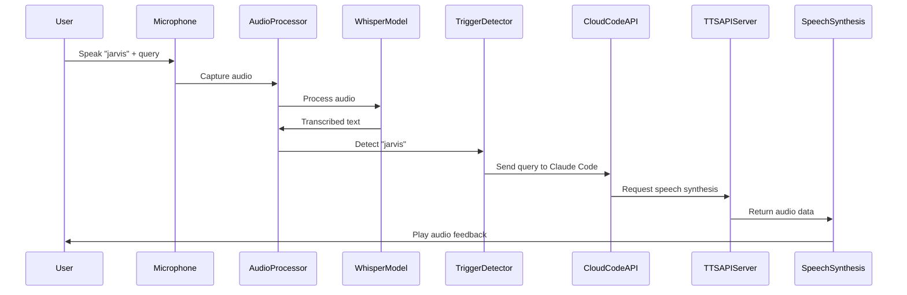
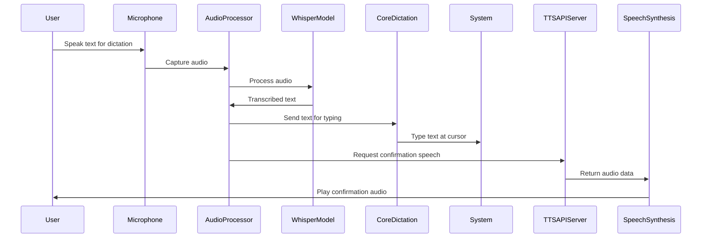
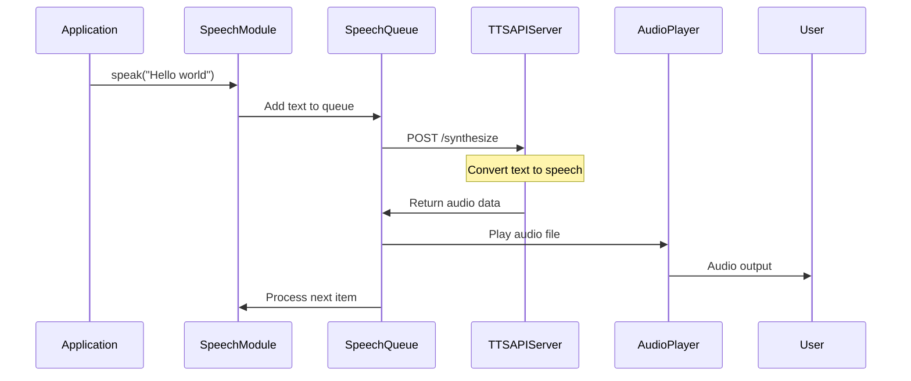
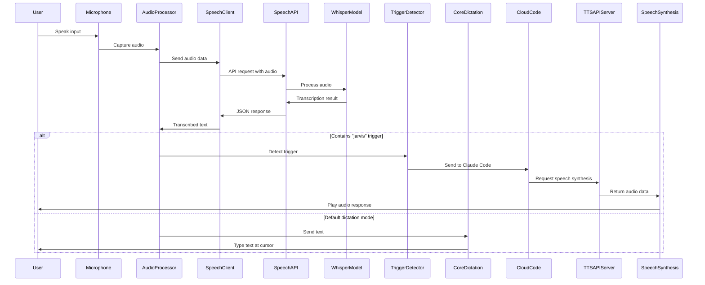
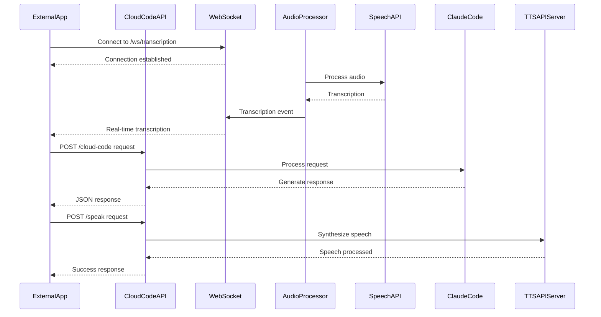

# System Architecture

This document outlines the high-level architecture of the voice control system, including component interactions and data flows.

## System Components

The system consists of several key components:

1. **Audio Recording**: Captures user's voice input
2. **Speech Recognition**: Transcribes audio to text using Whisper
   - Local model for standalone usage
   - Speech Recognition API for distributed processing
3. **Audio Processing**: Handles audio transcription and determines if it's:
   - Dictation (default) - types text at cursor position
   - Cloud Code request via "jarvis" trigger - sends to Claude Code
4. **Speech Synthesis**: Converts text to speech via external API
5. **UI Integration**: Provides user feedback
6. **Cloud Code API**: Allows external applications to integrate with speech recognition
7. **Standalone Speech API**: Provides speech recognition as a separate service

## Architecture Diagrams

### Basic Architecture

```
┌─────────────────┐     ┌─────────────────┐     ┌─────────────────┐
│                 │     │                 │     │                 │
│  Audio Input    ├────►│  Audio          ├────►│  Whisper        │
│  (Microphone)   │     │  Processor      │     │  Model          │
│                 │     │                 │     │                 │
└─────────────────┘     └─────────────────┘     └────────┬────────┘
                                                         │
                                                         ▼
┌─────────────────┐                             ┌─────────────────┐
│                 │                             │                 │
│  Core Dictation │◄──────────────┐             │  Text           │
│  (Type Text)    │               │             │  Transcription  │
│                 │               │             │                 │
└─────────────────┘               │             └─────────────────┘
                                  │                     │
                                  │                     │
┌─────────────────┐     ┌─────────┴───────┐     ┌──────▼────────┐
│                 │     │                 │     │                │
│  Audio Output   │◄────┤  Speech         │◄────┤  Cloud Code    │
│  (Speakers)     │     │  Synthesis      │     │  (via Jarvis)  │
│                 │     │                 │     │                │
└─────────────────┘     └─────────────────┘     └────────────────┘
```

### Distributed Architecture with Speech API

```
┌─────────────────┐     ┌─────────────────┐     ┌─────────────────┐
│                 │     │                 │     │                 │
│  Audio Input    ├────►│  Audio          ├────►│  Speech         │
│  (Microphone)   │     │  Processor      │     │  Recognition    │
│                 │     │                 │     │  Client         │
└─────────────────┘     └─────────────────┘     └────────┬────────┘
                                                         │
                                                         ▼
┌─────────────────┐     ┌─────────────────┐     ┌─────────────────┐
│                 │     │                 │     │                 │
│  Speech         │     │  Whisper        │     │  Speech         │
│  Recognition    │◄────┤  Model          │◄────┤  Recognition    │
│  API Server     │     │  (GPU Machine)  │     │  API Request    │
│                 │     │                 │     │                 │
└────────┬────────┘     └─────────────────┘     └─────────────────┘
         │
         ▼
┌─────────────────┐                             ┌─────────────────┐
│                 │                             │                 │
│  Cloud Code     │                             │  Text           │
│  API Server     │◄────────────────────────────┤  Transcription  │
│                 │                             │                 │
└────────┬────────┘                             └───────┬─────────┘
         │                                              │
         │                                              ▼
         │                                     ┌─────────────────┐
         │                                     │                 │
         │                                     │  Core Dictation │
         │                                     │  (Type Text)    │
         │                                     │                 │
         │                                     └─────────────────┘
         ▼
┌─────────────────┐     ┌─────────────────┐     ┌─────────────────┐
│                 │     │                 │     │                 │
│  Web Client     │     │  Speech         │◄────┤  External TTS   │
│  Applications   │     │  Synthesis      │     │  API Server     │
│                 │     │                 │     │                 │
└─────────────────┘     └─────────────────┘     └─────────────────┘
                                 │
                                 ▼
                        ┌─────────────────┐
                        │                 │
                        │  Audio Output   │
                        │  (Speakers)     │
                        │                 │
                        └─────────────────┘
```

## Sequence Diagrams

### Cloud Code Processing

This sequence diagram shows the flow from voice input to Cloud Code execution and speech feedback:



### Dictation Mode Flow

This sequence diagram shows the flow for dictation mode:



### Speech Synthesis Flow

This sequence diagram shows the detailed flow of the speech synthesis process:



### Speech Recognition API Flow

This sequence diagram shows the flow when using the standalone Speech Recognition API:



### Cloud Code API Integration

This sequence diagram shows how external applications can integrate with the system:



## Component Details

### Audio Processing

- Handles recording from microphone
- Manages silence detection and audio chunking
- Provides sound effects for user feedback
- Interfaces with Whisper for transcription
- Processes transcriptions to determine:
  - Default dictation mode (type at cursor)
  - Cloud Code requests (when "jarvis" trigger is detected)
- Can connect to external Speech Recognition API

### Speech Synthesis

- Communicates with external TTS API
- Manages text-to-speech request queue
- Handles audio playback
- Provides both blocking and non-blocking speech options
- Implements fallback mechanisms

### External TTS API Integration

- HTTP REST API interface
- JSON-based request/response format
- Authentication via API key
- Supports various voices and speech parameters
- Returns WAV format audio data

### Speech Recognition API

- Standalone service for speech recognition
- RESTful API endpoints for transcription
- WebSocket support for real-time transcription
- Multiple Whisper model support
- Can be deployed on separate machine with GPU
- Docker container support for easy deployment
- Fallback mechanisms for reliability

### Cloud Code API

- Integration point for external applications
- WebSocket server for real-time transcription events
- REST endpoints for command processing and speech synthesis
- JSON-based communication protocol
- Supports session management for contextual interactions
- Enables distributed application architecture

## Environment Configuration

The system uses environment variables for configuration:

### Main Voice Control System
```
SPEECH_API_URL="https://api.example.com/synthesize"
SPEECH_API_KEY="your_api_key_here"
WHISPER_MODEL_SIZE="large-v3"
USE_LLM="true"
LLM_MODEL_PATH="models/llm-model.gguf"
```

### Speech Recognition API
```
USE_SPEECH_API="true"
SPEECH_API_URL="http://gpu-server:8080"
DEFAULT_MODEL_SIZE="large-v3"
SPEECH_API_HOST="0.0.0.0"
SPEECH_API_PORT="8080"
```

### Cloud Code API
```
API_PORT="8000"
API_HOST="127.0.0.1"
```

For detailed environment configuration options, see `README.md` and `SPEECH_API.md`.
