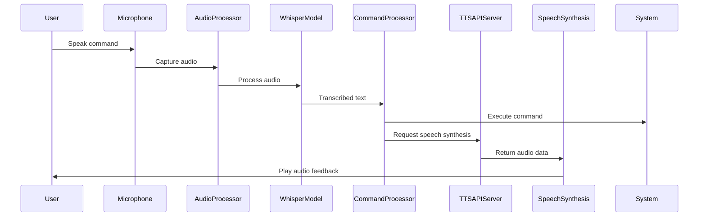
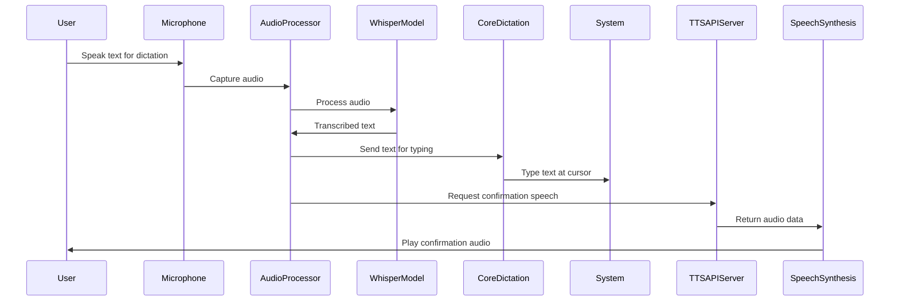
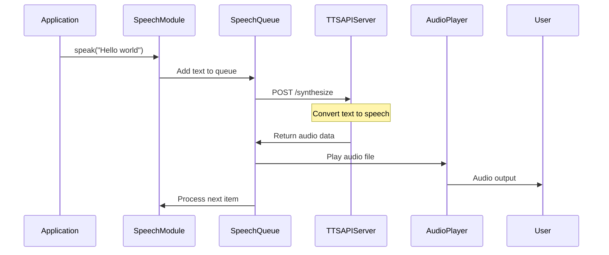

# System Architecture

This document outlines the high-level architecture of the voice control system, including component interactions and data flows.

## System Components

The system consists of several key components:

1. **Audio Recording**: Captures user's voice input
2. **Speech Recognition**: Transcribes audio to text using Whisper
3. **Command Processing**: Interprets text as commands or dictation
4. **Speech Synthesis**: Converts text to speech via external API
5. **UI Integration**: Provides user feedback

## Architecture Diagram

```
┌─────────────────┐     ┌─────────────────┐     ┌─────────────────┐
│                 │     │                 │     │                 │
│  Audio Input    ├────►│  Audio          ├────►│  Whisper        │
│  (Microphone)   │     │  Processor      │     │  Model          │
│                 │     │                 │     │                 │
└─────────────────┘     └─────────────────┘     └────────┬────────┘
                                                         │
                                                         ▼
┌─────────────────┐     ┌─────────────────┐     ┌─────────────────┐
│                 │     │                 │     │                 │
│  macOS System   │◄────┤  Command        │◄────┤  Text           │
│  (Actions)      │     │  Processor      │     │  Transcription  │
│                 │     │                 │     │                 │
└─────────────────┘     └────────┬────────┘     └─────────────────┘
                                 │
                                 │
┌─────────────────┐     ┌────────▼────────┐     ┌─────────────────┐
│                 │     │                 │     │                 │
│  Audio Output   │◄────┤  Speech         │◄────┤  External TTS   │
│  (Speakers)     │     │  Synthesis      │     │  API Server     │
│                 │     │                 │     │                 │
└─────────────────┘     └─────────────────┘     └─────────────────┘
```

## Sequence Diagrams

### Voice Command Processing

This sequence diagram shows the flow from voice input to command execution and speech feedback:



### Dictation Mode Flow

This sequence diagram shows the flow for dictation mode:



### Speech Synthesis Flow

This sequence diagram shows the detailed flow of the speech synthesis process:



## Component Details

### Audio Processing

- Handles recording from microphone
- Manages silence detection and audio chunking
- Provides sound effects for user feedback
- Interfaces with Whisper for transcription

### Command Processing

- Interprets transcribed text
- Identifies commands vs. dictation
- Uses LLM for natural language understanding (optional)
- Executes commands via appropriate system interfaces

### Speech Synthesis

- Communicates with external TTS API
- Manages text-to-speech request queue
- Handles audio playback
- Provides both blocking and non-blocking speech options
- Implements fallback mechanisms

### External TTS API Integration

- HTTP REST API interface
- JSON-based request/response format
- Authentication via API key
- Supports various voices and speech parameters
- Returns WAV format audio data

## Environment Configuration

The system uses environment variables for configuration:

```
SPEECH_API_URL="https://api.example.com/synthesize"
SPEECH_API_KEY="your_api_key_here"
WHISPER_MODEL_SIZE="base"
USE_LLM="true"
LLM_MODEL_PATH="models/llm-model.gguf"
```

For detailed environment configuration options, see `README.md`.